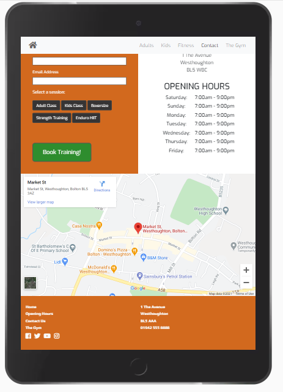

# Westhoughton Boxing Club website

Project - User Centric Frontend Development - Code Institute

This is a website to promote a fictional local boxing club. It serves as an advertisement for the club. It gives information about opening times, activities, schedules and contact details, whilst also providing a platform for new and current customers to book training sessions.
 

## UX
Three page site – all pages scrolling down to equivalent of 2-3 desktop pages.
Mobile version condenses each page to a single column. Home page provides details of activities and acts as an advertisement providing positive imagery plus information about who the club is aimed at and what activities are available.
Second page provides contact details, a map, a booking form and a contact section, plus further positive imagery.
Page three provides information about the gym and the various forms of training therein, including cards and photos for each of six gym areas.

### User Stories

1. As a user I would like to know what type of boxing club this is. Who is the club aimed at? 

* The home page scrolls to reveal class times for both adults and children. The nav bar also has options for both ‘Adults’ and ‘Children’. Both are links to the relevant sections lower down the page.

2.  As a user I would like to know when the club is open.

* Page two provides opening and closing times for all days of the week.  

3. As a user I would like to know where the club is located.

* Page two of the site (the Contact Us page) has a section beneath the main Hero image giving the address and contact details. Beneath the contact details is also an interactive Google Map showing the location of the club.  The Nav Bar also has a 'Contact' option, as does the Footer of each page.

4. As a user I would like to know if boxing lessons are available and, if so, how to go about booking a lesson/lessons.

* Page one of the site gives regular lesson times for both adults and children and has a ‘Booking Details’ button within each section which link to a booking form on the Contact Page (page 2). 

5. As a user I would like to see the facilities the club provides to check the environment is suitable for my needs.

* The Gym page (page 3) has imagery of each of the six training facilities within the club with a description of what each facility is used for.  The Gym page can be reached via both the Nav Bar and a link in the Footer section of each page.

### Wireframes

- Wireframes [link](https://github.com/AndyB-WHG/westhoughton-boxing-club/blob/master/wireframes-westhoughton-boxing-club.pdf) for 'Westhoughton Boxing Club'.

### Screenshots from finished site:

 
 

## Development

Initially the site was envisioned as two pages (Home and Contact) but soon expanded to three to include a Gym page. Having zero design experience, the decision was taken to look around the internet for design ideas rather than try to re-invent the wheel. A number of boxing websites were found to be very appealing so I decided to see if I could use my limited knowledge to re-create some of their ideas and layout. It was decided after some deliberation to include both custom CSS and Bootstrap coding in order to demonstrate some understanding of both.  Use of Bootstrap, whilst intended to ease and speed development, at first was difficult to implement and slowed the creation process to some extent.  Practice and familiarity soon began to bear fruit however and the creation of the third (Gym) page was ultimately straightforward as a direct result of the Bootstrap styling.

Similarly, the navigation bar (Nav bar) across the top of the site was initially difficult to implement due to lack of familiarity with Bootstrap and also due to issues blending the Bootstrap code with my own custom CSS code to create a harmonious design.  The resultant effect was very pleasing, however, although the difficulties resulted in the drop-down list running along the left hand side of the screen rather than the right, to my slight disappointment. Efforts to correct this were unsuccessful, and, due to time constraints, it was necesaary to move on to other features without a solution.

For the second page it was decided from the outset to include both a 'Contact Us' section and an interactive map.  As the project developed rContact Us form was re-designed into a more focussed 'Booking Form', rather than the simple contact/email us form originally envisaged. Initially the new form design included standard Radio Buttons and worked very well, but a search on the internet yielded a blog on the Markheath.net website in which the author had kindly explained (and provided coding for) how to improve the standard Radio Button styling using custom CSS code to give a more pleasing set of shaped buttons which changed colour when selected.  After a few changes to the styling attributes to suit the site colours/design, the result was a much improved look and feel, both for the user and the designer.

The Gym page was intended to provide information about the gym itself, primarly by focussing on the various training sections within the club. After an initial discussion with my mentor regarding overall look and feel, he suggested using Bootstrap 'Cards' to create an appealing experience for the user. The reasoning being that the cards would provide both an image and a description in a neat, self-contained layout, keeping things both simple and easy on the eye.  Having initially agreed, I became worried soon after, given my issues initally implementing Boostrap as discussed earlier.  In the end, however, it was a simple matter to implement once a little Bootstrap experience had been gained - and the result was extremely pleasing.  During the final Mentor session, I suggested that the look of the cards could be improved very slighyly with a squaring off of the corners.  My mentor supplied a style code to implement and it worked very nicely, resulting in a very nice, polished finish to the section.

Coding finished, it was thought that Validation would be a formality. It turned out, however, to be a more complex process than anticipated.  Aria labels were at first an issue, with a misundertanding on the developers part regarding where and how to implement. Thankfully this was resolved without too many difficulties. Further issues were found regarding text within spans, again due to a lack of understanding regarding 'p' and 'h' elements. Again, resolved relatively quickly - it also provied a good source of learning. Eventually the issues disappeared and the overall result is, hopefully, a responsive and attractive site which, if it were for a real boxing club, would provide a enjoyable and pain free user experience.

## Features
### 1. Home page icon at top left gives users the option to go back to the top of the home page at any time.  Static and fixed to top of page with content scrolling beneath.
### 2. Static Nav Bar across top of all pages giving quick access to the various site sections. Allows users to quickly navigate to various parts of the website.
### 3. Burger button at top right on Mobile screen-sizes which expands to give the same Navigation options seen on larger screen sizes.
### 4. ‘Booking Details’ buttons within various timetable sections on home page. Buttons connect directly to ‘Contact Form’ on page 2 to enable users to book training sessions and lessons.
### 5. ‘Booking’ form within 'Contact' page - includes various text input fields and a radio-button selection to enable users to book lessons or fitness sessions.
### 6. Links within Footer section to social media sites (Twitter, Instagram, Youtube, Facebook) to build wider appeal.
### 7. Interactive map beneath Contact Details section on page 2 to enable users to see exactly where the gym is located and plan a route if required.
### 8. Gym page has 'Book Session' buttons within each of the six cards linking to the 'Booking Form' on the 'Contact' page. 

## Technologies Used

[HTML5](https://developer.mozilla.org/en-US/docs/Glossary/HTML5), [CSS3](https://en.wikipedia.org/wiki/CSS) and [Boostrap v.4.1](https://getbootstrap.com/docs/4.1/getting-started/introduction/) implemented to make the site both responsive to various viewports and pleasing to view.
[Balsamiq](https://balsamiq.com/) wireframes were used to design the initial look of the site.

## Testing

* Home link at top left of all pages tested and works as expected.
* All Nav Bar links tested on each of the three pages and were found to be working as expected.
* Nav links condense into a single 'Burger' icon at top right on small/mobile-sized viewports as expected.
* 'Burger' buttton expands to provide all links seen on larger screen sizes as expected.
* Scroll bar on all three pages works as expected.
* ‘Booking Details’ buttons for each of the three sections (Adults, Kids, Fitness) all tested and link to the ‘Contact Us’ section as designed.
* All social media links in Footer sections of each page work as expected and open in a separate browser tab.  
* All internal links in Footer sections of each page work as as expected.
* Mobile version of pages render as a single column as designed.
* All medium sized viewports render as two columns as expected. The 'Cards' section of the 'Gym' page renders in three columns for larger viewports as designed.
* 'Booking Form' form tested and works as expected: all fields require an input;  email field requires a valid email format. Submission is prevented unless all relevant data has been correctly provided, and a radio button selected.

Note: the expanded Nav Burger options currently list to left of the screen. It was envisaged they would expand to the right but have been unable to resolve at the current time.

## Deployment

Project was developed using the Gitpod online IDE (integrated development environment) and pushed to the Github collaborative development platform.

The repository for devopment and collaboration purposes can be found at [Github - Westhoughton Boxing Club](https://github.com/AndyB-WHG/westhoughton-boxing-club).

The finished project is hosted on GitHub Pages at the following address:  [https://andyb-whg.github.io/westhoughton-boxing-club/](https://andyb-whg.github.io/westhoughton-boxing-club/).

The site is deployed through Github using their built in web-publishing and hosting service. Please see the video at https://pages.github.com/ for detailed information.

## Credits

### Content
- Coding for the re-styled radio buttons within the booking form on the Contact Page was copied and adapted from an educational blog posting on the Markheath.net website (https://markheath.net/post/customize-radio-button-css).
- Narrative for the 'Pads Card' within the 'Gym' page is adapted from the Decathlon Store website "https://play.decathlon.co.uk/articles/why-and-how-to-use-pads".
- The use of Bootstrap Cards on the Gym page was suggested by my Mentor, Marcel. The card implementation was all my own work except for the removal of a small radius at the corners of each of the cards, the code for the styling of which was given by Marcel.  Code given was: style="border-radius: 0px;".
- Added 'font-display; swap' to style.css as per Chrome 'Lighthouse' advice, to prevent invisible fonts at page load-up.

### Media
The photos used in this site were obtained from Unsplash.com and Pexels.com:

1. index.html images:
- Hero-image boxing ring photo by David Guliciuc on Unsplash.com.
- Men boxing photo by David Guliciuc on Unsplash.com.
- Child boxing photo by David Guliciuc on Unsplash.com.
- Fitness photo by Leon Ardho from Pexels.com.

2. contact.html images:
- Boxing gloves photo by Prateek Katyal on Unsplash.com.

3. gym.html:
- Gym hero image by Wade Austin Ellis on Unsplash.com.
- Dumbells photo by Danielle Cerullo on Unsplash.com.
- Pads session photo by cottonbro from Pexels.com.
- Punch bag photo by Milo Bunnik on Unsplash.com.
- Sparring photo by cottonbro from Pexels.com.
- Skipping photo by cottonbro from Pexels.
- Endurance photo by Sven Mieke on Unsplash.

The images listed above were optimized and compressed on the free to use TinyJPG website (https://tinyjpg.com/).

Exo and Play fonts were imported from the free Google Fonts website (https://fonts.google.com/).

The Dumbell icon was imported free of charge from, and kindly provided by, Font Awesome (https://fontawesome.com/).

The map data is provided by Google Maps (https://www.google.co.uk/maps/.)

The shortened Google Maps link was ceated using the free to use Bitly website (https://bitly.com/).

### Acknowledgements

I received inspiration for this project from Code Institute who originally suggested a ‘gym’ website, which led to a variation on that theme due to my interest in boxing. 

Ideas for design layout came mainly from ‘The Rathbone Boxing Club’ website, based in London, ‘The Fight Factory’ boxing club in Manchester and ‘MTK Liverpool’ boxing and fitness club.
General information and knowledge came from both the Code Institute course materials and W3Schools.com.

Image optimisation information was gained from Jimdo.com (https://www.jimdo.com/blog/optimize-website-images-for-better-design-seo/)
